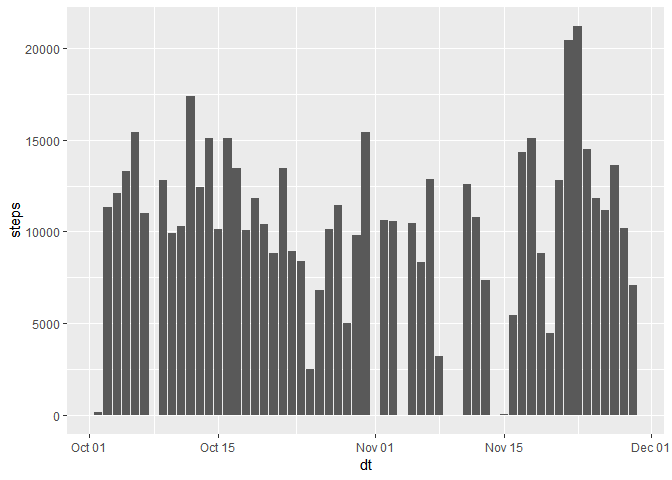
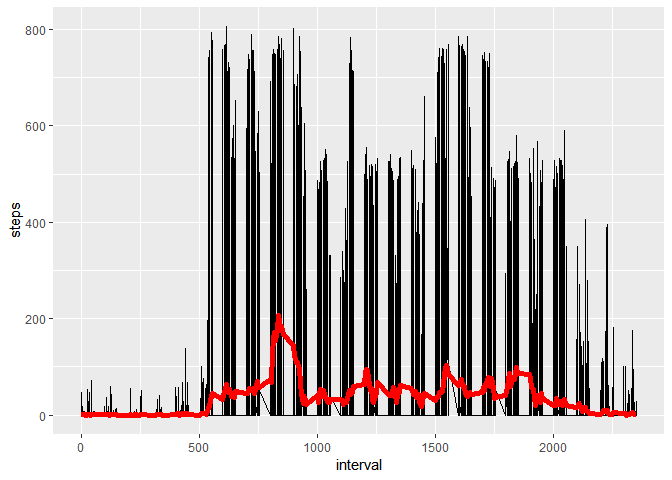
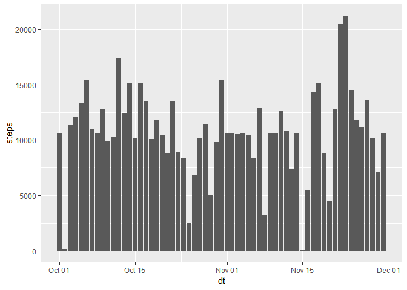
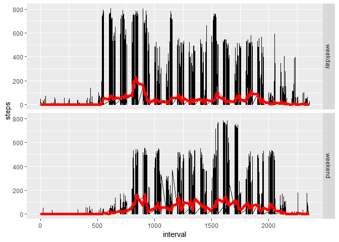

## Loading and preprocessing the data

```r
  library(dplyr)
```

```
## Warning: package 'dplyr' was built under R version 3.5.2
```

```
## 
## Attaching package: 'dplyr'
```

```
## The following objects are masked from 'package:stats':
## 
##     filter, lag
```

```
## The following objects are masked from 'package:base':
## 
##     intersect, setdiff, setequal, union
```

```r
  library(ggplot2)
```

```
## Warning: package 'ggplot2' was built under R version 3.5.2
```

```r
  d=read.csv("activity.csv", stringsAsFactors = FALSE)
  x=complete.cases(d)
  final = tbl_df(d[x,])
  final = final %>% mutate(date=as.Date(date))
```

```
## Warning: package 'bindrcpp' was built under R version 3.5.2
```


## What is mean total number of steps taken per day?

```r
  noOfStepsByDate = final %>% group_by(date) %>% summarise(steps=sum(steps)) %>% mutate(dt=as.Date(date))
  ggplot(noOfStepsByDate, aes(x=dt, y=steps))+geom_col()
```

<!-- -->


```r
  summary(noOfStepsByDate$steps)
```

```
##    Min. 1st Qu.  Median    Mean 3rd Qu.    Max. 
##      41    8841   10765   10766   13294   21194
```


## What is the average daily activity pattern?

```r
ggplot(final, aes(x=interval, y=steps))+geom_line()+stat_summary(geom="line",lwd=2, col="red")
```

```
## No summary function supplied, defaulting to `mean_se()
```

<!-- -->


```r
noOfStepsByDate = final %>% group_by(interval) %>% summarise(steps=mean(steps))  %>% arrange(desc(steps))
noOfStepsByDate[1,]
```

```
## # A tibble: 1 x 2
##   interval steps
##      <int> <dbl>
## 1      835  206.
```

## Imputing missing values
Missing Values Count

```r
NumberOfMissingValues=count(tbl_df(d[!x,]))
as.numeric(NumberOfMissingValues)
```

```
## [1] 2304
```

```r
avgStepsPerInterval = final %>% group_by(interval) %>% summarise(steps=mean(steps))
filledData=left_join(d[!x,],avgStepsPerInterval, by=c('interval')) %>% select(date,interval, steps.y)
colnames(filledData) <- c('date', 'interval', 'steps')
filledData <- tbl_df(filledData)
filledData= filledData %>% mutate(steps=as.integer(steps)) %>% mutate(date=as.Date(date))
all_data=full_join(filledData, final)
```

```
## Joining, by = c("date", "interval", "steps")
```

```r
noOfStepsByDate1 = all_data %>% group_by(date) %>% summarise(steps=sum(steps)) %>% mutate(dt=as.Date(date))
  ggplot(noOfStepsByDate1, aes(x=dt, y=steps))+geom_col()
```

<!-- -->

```r
  summary(noOfStepsByDate$steps)
```

```
##    Min. 1st Qu.  Median    Mean 3rd Qu.    Max. 
##   0.000   2.486  34.113  37.383  52.835 206.170
```
Comparing with the mean and median of the partial data, there is no significant difference after imputing missing data.
  
  
## Are there differences in activity patterns between weekdays and weekends?

```r
  f_day = function(...){
    val = weekdays(...)
    #print(val)
    if (val == 'Sunday' || val == 'Saturday'){
      "Weekends"
    }
    else{
      "weekdays"
    }
  }
  all_data_group_by_week = all_data %>% mutate(weekday= ifelse(weekdays(date) %in% c("Saturday", "Sunday"), "weekend", "weekday")) %>% group_by(weekday) %>% summarize(steps=sum(steps))
  
  all_data_group_by_week
```

```
## # A tibble: 2 x 2
##   weekday  steps
##   <chr>    <int>
## 1 weekday 460762
## 2 weekend 194974
```


```r
all_data1 = all_data %>% mutate(weekday= ifelse(weekdays(date) %in% c("Saturday", "Sunday"), "weekend", "weekday"))


ggplot(all_data1, aes(x=interval, y=steps))+geom_line()+facet_grid(weekday ~ .)+stat_summary(geom="line",lwd=2, col="red")
```

```
## No summary function supplied, defaulting to `mean_se()
## No summary function supplied, defaulting to `mean_se()
```

<!-- -->
